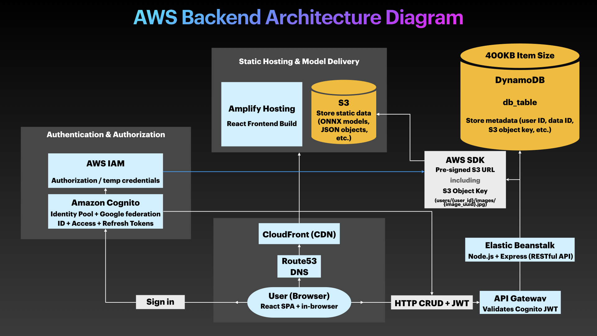

<div align='center'>
  <h1> Interview Questions </h1>
</div>

# 1) Which AWS services should be used to implement user registration (sign-up), authentication (sign-in), and authorization?

**Answer**:

- Use [Amazon Cognito User Pools](https://docs.aws.amazon.com/cognito/latest/developerguide/cognito-user-pools.html) for user registration and authentication. Cognito handles user accounts, sign-up/sign-in flows, and issues JWTs (ID/access tokens) after successful authentication.

- Use `IAM` for authorization of access to AWS resources (e.g., S3, DynamoDB, Lambda).

---

# 2) Which AWS services should be used to save user data and fetch content?

**Answer**:

- Use `AWS S3` to store static/object data (e.g., images, videos, etc.).

- Use `DynamoDB` to store application metadata (e.g., user_id, image_id, filename, timestamp), including references such as an S3 object key. Each DB item has a maximum size of 400 KB.

- Use [API Gateway](https://aws.amazon.com/api-gateway/) + [AWS Lambda](https://aws.amazon.com/pm/lambda) to implement a serverless RESTful API or Express to implement a server-based RESTful API for handling CRUD operations via HTTPS.

- Alternatively, use AWS AppSync to implement a serverless GraphQL API.

- Use a CDN to cache frequently accessed images for low-latency delivery.

---

# 3) Draw the full backend diagram for uploading/downloading/deleting premium data to/from S3 through an Express REST API backed by DynamoDB and deployed to Elastic Beanstalk.

**Answer**:

<p align="center">
  
</p>

The AWS SDK generates a temporary [pre-signed URL](https://docs.aws.amazon.com/AmazonS3/latest/userguide/using-presigned-url.html) with the credentials (authorization information) of the IAM principal used by the application. It is generated on demand and expires, so it is not persisted in the database as the canonical reference for the object.

There is no need to implement an S3 (or IAM) API call to get the IAM role. Elastic Beanstalk's EC2 instances use an IAM instance profile, which contains an IAM role with the permissions required by the application. The AWS SDK automatically obtains temporary credentials for that role through the [EC2 Instance Metadata Service (IMDS)](https://docs.aws.amazon.com/AWSEC2/latest/UserGuide/instancedata-data-retrieval.html).

- The infrastructure is configured as:

```
1. Elastic Beanstalk
2. EC2 instance has
3. EC2 Instance Profile that contains
4. IAM Role
       - s3:GetObject
       - other required permissions
```

- Upload Flow (see [PutObject URL](https://docs.aws.amazon.com/AmazonS3/latest/developerguide/s3_example_s3_PutObject_section.html)):

```
1. User logs in with Cognito.

2. Amazon Cognito issues an ID token, access token, and refresh token.

3. Client sends a POST request with the access token in the Authorization header to `/premium-data/:id`.
       - Authorization: Bearer <access-token>

4. API Gateway (optional, not required if Express handles token validation) validates the access token.

5. Express on Elastic Beanstalk authenticates and authorizes the user.
       - Is the user premium/trial?
       - Is the data included in the subscription?

6. Express generates a unique S3 Object Key (e.g., `users/{user_id}/premium-images/{image_uuid}.jpg`)
and sets a record status to PENDING in DynamoDB.
       - DynamoDB
              - image_id
              - user_id
              - s3_key
              - status = PENDING
              - metadata...

7. Express uses the AWS SDK to generate a pre-signed S3 PutObject URL for the specific bucket, key,
and operation using the backend IAM credentials. SDK obtains temporary credentials from the
EC2 Instance Metadata Service for the EC2 IAM role.

8. Express returns the URL to the client.

9. Client sends a PUT request to the <pre-signed-S3-URL> to upload the object directly to S3.

10. Amazon S3 validates the signature, checks the expiration, and authorizes the signed request.

11. The client confirms the upload with Express.

12. Optional step. Express verifies that the object exists in S3 and/or validates its metadata.

13. Express marks the object as COMPLETED in DynamoDB. However, if the S3 upload succeeds but the DynamoDB write fails,
you end up with an orphaned S3 object. A production system therefore needs some cleanup/reconciliation strategy.
       - DynamoDB
              - image_id
              - user_id
              - s3_key
              - status = COMPLETED
              - metadata...
```

- Download Flow (see [GetObject URL](https://docs.aws.amazon.com/AmazonS3/latest/developerguide/s3_example_s3_GetObject_section.html)):

```
1. Client sends a GET request with the access token in the Authorization header to `/premium-data/:id`.
       - Authorization: Bearer <access-token>

2. Express on Elastic Beanstalk authenticates and authorizes the user.
       - Is the user premium/trial?
       - Is the data included in the subscription?

3. Express retrieves the S3 object key from DynamoDB. Example: s3_key = `users/USER_id/premium-image/image_id.jpg`

4. Express uses the AWS SDK to generate a pre-signed GetObject URL.

5. Express returns the URL to the client.

6. Client sends a GET request to the <pre-signed-S3-URL>, and S3 returns the object directly to the client.
```

- Delete Flow (does not require a pre-signed URL):

```
1. Client sends a DELETE request to `/premium-data/:id`.

2. Express on Elastic Beanstalk authenticates and authorizes the user.
       - Is the user premium/trial?
       - Is the data included in the subscription?

3. Express retrieves the S3 object key from DynamoDB.

4. Express uses the AWS SDK to delete the data directly from S3 using the s3_key.
```

---

# 4) Which AWS services should be used to design a chat app with 1-10k concurrent users, low throughput (10 MB/second), and near-real-time synchronization?

**Answer**:

- Use [AWS API Gateway WebSockets](https://docs.aws.amazon.com/apigateway/latest/developerguide/apigateway-websocket-api-overview.html) or [AppSync Events](https://docs.aws.amazon.com/appsync/latest/eventapi/event-api-welcome.html) to implement a WebSocket API for near-real-time communication (send/receive messages), and events (typing receipt, presence).
- Use `AWS AppSync` to implement a GraphQL API that can handle CRUD operations (e.g., delete a chat, create a group, fetch profile, etc.).
- Use [AppSync subscriptions](https://docs.aws.amazon.com/appsync/latest/devguide/aws-appsync-real-time-data.html) for real-time fan-out (live application updates, push notifications, etc.)

---

# 5) Which AWS services should be used for a general-purpose, long-running workload that exceeds AWS Lambda's 15-minute timeout (e.g., video processing, ML training, and inference)?

**Answer**:

- Use [Amazon EC2](https://aws.amazon.com/ec2) instances to deploy custom long-running functions.

- Fargate is not suitable for LLM training because it does not support GPU instances. EC2 instances must be manually configured instead.

- AWS Lambda can still be used to initiate or coordinate these jobs, but it is not suitable for executing them directly if they are long-running.

The mistake would be:

```
API Gateway -> Lambda -> Run AI inference for 20 minutes
```

The correct flow is:

```
1. API Gateway

2. Lambda

3. Create Job

4. SQS Queue

5. EC2 GPU Worker

6. LLM inference

7. Store result
```

---

# 6) Which AWS services should be used for batch-style long-running workloads (e.g., simulation, video processing, and ML training jobs)?

**Answer**:

- Use [AWS Batch](https://aws.amazon.com/batch/) for custom long-running simulations (e.g., robotics, autonomous vehicles), machine learning training/inference, and custom video transcoding as an alternative to MediaConvert.

- Use [Amazon SageMaker](https://aws.amazon.com/sagemaker) for machine learning training job and inference.

---

# 7) Which AWS services should be used to design an app that requires 1M+ long-lived concurrent connections (e.g., chat apps, multiplayer games, etc.) and high throughput?

**Answer:**

- For 1M+ long-lived concurrent connections and high throughput (millions of requests per second), set up a [Network Load Balancer (NLB)](https://docs.aws.amazon.com/elasticloadbalancing/latest/network/introduction.html) that operates at the transport layer 4 (TCP/UDP) to distribute TCP traffic to backend workloads (such as containers running on EC2 instances with ECS/EKS as the orchestration layer), then possibly an [Application Load Balancer (ALB)](https://docs.aws.amazon.com/elasticloadbalancing/latest/application/introduction.html) if application Layer 7 features are required further downstream (e.g., HTTP routing and WAF).

- For large-scale workloads requiring millions of concurrent connections, configure the Network Load Balancer to use the [IP target type](https://docs.aws.amazon.com/elasticloadbalancing/latest/network/load-balancer-target-groups.html#target-type) instead of the [instance target type](https://docs.aws.amazon.com/elasticloadbalancing/latest/network/load-balancer-target-groups.html#target-type). This enables more granular load balancing across containerized services or multiple Elastic Network Interface (ENI) backends, improving scalability and connection distribution.
- For real-time communication, implement a custom WebSocket API with either `uWebSockets.js`, `Colyseus`, or `Socket.IO`, instead of using [API Gateway WebSocket API](https://docs.aws.amazon.com/zh_tw/apigateway/latest/developerguide/apigateway-websocket-api.html) (see the [notes section](#notes)).

---

# 8) Which AWS services should be used to design a multiplayer game app that requires low latency (< 50ms delay), high frequency updates (20 to 120Hz), and persistent connections?

**Answer:**

- Build the game server, which is a project containing many source files, including the authoritative game loop that maintains world state and processes player input. For multiplayer features, implement a persistent real-time network layer (most commonly WebSocket) inside the game server using either `uWebSockets.js`, `Colyseus`, or `Socket.IO`.

- Containerize the entire game server application, push the Docker image to Amazon ECR, and run it on an always-on Amazon EC2 instance backed by ECS/EKS as the orchestration layer for scalability.

- Stateful Services (persistent demand):
  - Use a stateful TCP socket to connect clients directly to stateful game servers with long-running processes, such as world exploration and multiplayer interactivity. The player keeps the same long-lived (persistent) TCP connection open. Amazon EC2 instances keep in-memory game state and maintain persistent connections.

- Stateless Services (on-demand):
  - The communication API for non-realtime workload (authentication/login, player profile, leaderboards, game history, updating inventory/stats, searching for games, etc.) can be a serverless `RESTful API` implemented with [API Gateway](https://aws.amazon.com/api-gateway/) + [AWS Lambda](https://aws.amazon.com/pm/lambda) + [Elastic Load Balancer](). Easier to scale horizontally since it is a stateless service.

- Alternatively, use [Amazon GameLift](https://aws.amazon.com/gamelift/).

- Check [this Amazon Guide](https://aws.amazon.com/blogs/gametech/stateful-or-stateless/).

---

# 9) Which AWS services should be used to design a real-time video conferencing app that requires low latency, high throughput (high data volume, such as video + audio streams), and persistent connections?

**Answer:**

- For real-time audio/video communication, use [Amazon Chime](https://aws.amazon.com/chime/). The SDK provides WebRTC under the hood (which maintains a persistent connection), includes built-in network address translation (NAT) using the ICE framework, and does not require users to manually set up STUN or TURN servers.
- The communication API (create meeting, add/delete attendees, etc.) can be a serverless `RESTful API` implemented with [API Gateway](https://aws.amazon.com/api-gateway/) + [AWS Lambda](https://aws.amazon.com/pm/lambda).
- The frontend can be hosted on Amplify, while the backend can be deployed on Elastic Beanstalk (monolithic) or Fargate through ECS/EKS (microservices).

---

# 10) Which AWS services should be used to implement a priority queue for a hospital reservation system?

**Answer:**

- If strict priority ordering is essential (e.g., emergency patients processed first), use [Amazon MQ](https://aws.amazon.com/amazon-mq/) with [RabbitMQ](https://www.rabbitmq.com/) message broker engine.

- If approximate priority handling (via multiple queues) is acceptable and you want simplicity + serverless scaling, [Amazon SQS](https://aws.amazon.com/sqs/) works fine.

- The communication API can be a serverless `RESTful API` implemented with [API Gateway](https://aws.amazon.com/api-gateway/) + [AWS Lambda](https://aws.amazon.com/pm/lambda).

---

# Notes

- The frontend can always be hosted (stored on S3 and served through CloudFront) using Amplify. The backend of lightweight apps can be deployed with Amplify, which uses **CloudFormation** under the hood to integrate different backend services. However, the backend of long-running apps should be deployed either directly on EC2 instances or via Fargate.

- A `long-running HTTP` server is different from a `long-running computation`.
  - A long-running HTTP server maintains connections or continuously serves requests (e.g., Server-Sent Events, WebSockets, real-time collaboration, live dashboards).
    - Such servers can be implemented using `Express.js` (SSE), `Socket.io` (WebSockets), `Fastify`, or the built-in http module and are typically deployed on long-running compute platforms such as EC2, ECS/Fargate, EKS, or other container/VM platforms.
    - `API Gateway + Lambda` works fine for building a serverless RESTful API for stateless request-response services, but is generally not appropriate for building APIs that require low-latency (Lambda has a cold start) and `stateful (persistent) HTTP connections`, because of their timeout constraints: [~29 seconds timeout for API Gateway](https://aws.amazon.com/tw/about-aws/whats-new/2024/06/amazon-api-gateway-integration-timeout-limit-29-seconds/), and [15 minutes timeout for Lambda](https://docs.aws.amazon.com/lambda/latest/dg/configuration-timeout.html). Lambda is fundamentally request-driven rather than connection-oriented.
  - A long-running computation is independent of how the API is implemented.
    - The computation can run on EC2, ECS, Batch, Kubernetes, or other compute platforms, regardless of whether the communication API was built using `Express.js` or `API Gateway + Lambda`.
- While API Gateway does not enforce a quota on concurrent connections, API Gateway WebSockets has a [maximum connection duration (lifetime) of 2 hours](https://docs.aws.amazon.com/apigateway/latest/developerguide/apigateway-execution-service-websocket-limits-table.html). For services that require low-latency, persistent connections, and stateful, bidirectional communication, ALB/NLB + a custom WebSocket server running on an EC2 instance is a better architectural fit.

- NLB is protocol-agnostic, i.e., it does not interpret, parse, or modify application-layer protocols, it only forwards raw transport-layer traffic. It only looks at source/destination IP and port and does not care if bytes are HTTP requests, WebSocket frames, TLS, or raw binary.

- Fan-In: Number of components that call into a service.

- Fan-Out: Number of outgoing requests or connections a service/component makes to other components to fulfill a single task or request.

- Frequency: How often data is sent. Typically measured in updates per second (Hz), per connection.

- Throughput: Can refer to either data throughput (bytes/second) or request throughput (requests/second).

- STUN (Session Traversal Utilities for NAT) and TURN (Traversal Using Relays around NAT) are protocols used in real-time communication over the internet, particularly in WebRTC (Web Real-Time Communication) and similar technologies that require peer-to-peer connectivity (e.g., video calls, file sharing).
