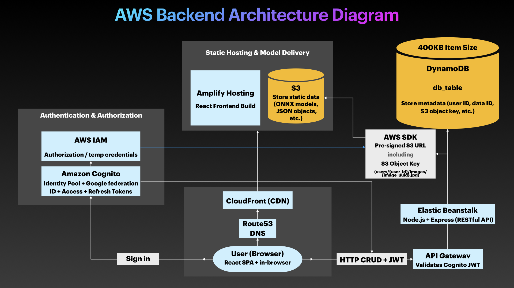

<div align='center'>
  <h1> Interview Questions </h1>
</div>

# Table of Contents

- [Q1) Which AWS services should be used to implement user registration (sign-up), authentication (sign-in), and authorization?](#q1-which-aws-services-should-be-used-to-implement-user-registration-sign-up-authentication-sign-in-and-authorization)
- [Q2) Which AWS services should be used to save user data and fetch content?](#q2-which-aws-services-should-be-used-to-save-user-data-and-fetch-content)
- [Q3) Draw the full backend diagram for uploading/downloading/deleting premium data to/from S3 through an Express REST API backed by DynamoDB and deployed to Elastic Beanstalk.](#q3-draw-the-full-backend-diagram-for-uploadingdownloadingdeleting-premium-data-tofrom-s3-through-an-express-rest-api-backed-by-dynamodb-and-deployed-to-elastic-beanstalk)
- [Q4) Which AWS services should be used to design a chat app with 1-10k concurrent users, low throughput (10 MB/second), and near-real-time synchronization?](#q4-which-aws-services-should-be-used-to-design-a-chat-app-with-1-10k-concurrent-users-low-throughput-10-mbsecond-and-near-real-time-synchronization)
- [Q5) Which AWS services should be used for a general-purpose, long-running workload that exceeds AWS Lambda's 15-minute timeout (e.g., video processing, ML training, and inference)?](#q5-which-aws-services-should-be-used-for-a-general-purpose-long-running-workload-that-exceeds-aws-lambdas-15-minute-timeout-eg-video-processing-ml-training-and-inference)
- [Q6) Which AWS services should be used for batch-style long-running workloads (e.g., simulation, video processing, and ML training jobs)?](#q6-which-aws-services-should-be-used-for-batch-style-long-running-workloads-eg-simulation-video-processing-and-ml-training-jobs)
- [Q7) Which AWS services should be used to design an application that requires long-lived concurrent connections and high throughput (e.g., chat apps and multiplayer games, etc.)?](#q7-which-aws-services-should-be-used-to-design-an-application-that-requires-long-lived-concurrent-connections-and-high-throughput-eg-chat-apps-and-multiplayer-games-etc)
- [Q8) Which AWS services should be used to design a multiplayer game app that requires low latency (< 50ms delay), high frequency updates (20 to 120Hz), and persistent connections?](#q8-which-aws-services-should-be-used-to-design-a-multiplayer-game-app-that-requires-low-latency--50ms-delay-high-frequency-updates-20-to-120hz-and-persistent-connections)
- [Q9) Which AWS services should be used to design a real-time video conferencing app that requires low latency, high throughput (high data volume, such as video + audio streams), and persistent connections?](#q9-which-aws-services-should-be-used-to-design-a-real-time-video-conferencing-app-that-requires-low-latency-high-throughput-high-data-volume-such-as-video--audio-streams-and-persistent-connections)
- [Q10) Which AWS services should be used to implement a priority queue for a hospital reservation system?](#q10-which-aws-services-should-be-used-to-implement-a-priority-queue-for-a-hospital-reservation-system)
- [Notes](#notes)
- [Glossary](#glossary)

---

# Q1) Which AWS services should be used to implement user registration (sign-up), authentication (sign-in), and authorization?

**Answer**:

- Use [Amazon Cognito User Pools](https://docs.aws.amazon.com/cognito/latest/developerguide/cognito-user-pools.html), an identity directory for user registration (sign-up), authentication (sign-in), and federated login for authentication through an external Identity Provider (e.g., Google, Apple). Cognito handles user accounts, sign-up/sign-in flows, and issues JWTs (ID/access tokens) after successful authentication.

- Use Cognito Identity Pool to get temporary IAM credentials for authorization to AWS services.

---

# Q2) Which AWS services should be used to save user data and fetch content?

**Answer**:

- Use `AWS S3` to store static/object data (e.g., images, videos, etc.).

- Use `DynamoDB` to store application metadata (e.g., user_id, image_id, filename, timestamp), including references such as an S3 object key. Each DB item has a maximum size of 400 KB.

- Use [API Gateway](https://aws.amazon.com/api-gateway/) + [AWS Lambda](https://aws.amazon.com/pm/lambda) to implement a serverless RESTful API or Express to implement a server-based RESTful API for handling CRUD operations via HTTPS.

- Alternatively, use AWS AppSync to implement a serverless GraphQL API.

- Use CloudFront (CDN) to cache frequently accessed images for low-latency delivery.

---

# Q3) Draw the full backend diagram for uploading/downloading/deleting premium data to/from S3 through an Express REST API backed by DynamoDB and deployed to Elastic Beanstalk.

**Answer**:

<p align="center">
  
</p>

The AWS SDK generates a temporary [presigned URL](https://docs.aws.amazon.com/AmazonS3/latest/userguide/using-presigned-url.html) with the credentials (authorization information) of the IAM principal used by the application. It is generated on demand and expires, so it is not persisted in the database as the canonical reference for the object. Only the S3 object key is persisted.

There is no need to implement an S3 (or IAM) API call to get the IAM role. Elastic Beanstalk's EC2 instances use an IAM instance profile, which contains an IAM role with the permissions required by the application. The AWS SDK automatically obtains temporary credentials for that role through the [EC2 Instance Metadata Service (IMDS)](https://docs.aws.amazon.com/AWSEC2/latest/UserGuide/instancedata-data-retrieval.html).

- The infrastructure is configured as:

```
1. Elastic Beanstalk.
2. EC2 instance that has an EC2 Instance Profile containing the IAM Role.
3. The IAM Role has a Policy (Json file) that has Statements that lists Actions, such as:
       - s3:PutObject     (Upload object to S3. Needed to sign presigned PUT URLs)
       - s3:GetObject     (Download object from S3. Needed to sign presigned GET URLs, and HeadObject)
       - s3:DeleteObject  (Delete object from S3)
       - dynamodb:PutItem     (Create or overwrite an item) 
       - dynamodb:GetItem     (Read an item by key)
       - dynamodb:UpdateItem  (Modify item's attributes)
       - dynamodb:DeleteItem  (Delete an item)

Scope each permission to the specific bucket/prefix and table ARN (least privilege).
```

- Object key convention (used consistently in all flows):
```bash
users/{user_id}/premium-images/{image_id}.jpg
```

- Upload Flow (see [PutObject URL](https://docs.aws.amazon.com/AmazonS3/latest/developerguide/s3_example_s3_PutObject_section.html)):

```
1. User logs in with Cognito.

2. Amazon Cognito issues an ID token, access token, and refresh token.

3. Client sends a POST request with the access token in the Authorization header to `/premium-data/`.
       - Authorization: Bearer <access-token>

4. API Gateway (optional, not required if Express handles token validation) validates the access token.

5. The backend Express server on Elastic Beanstalk authenticates and authorizes the user.
       - Is the user premium/trial?
       - Is the data included in the subscription?

6. The Express server generates a unique `image_id` (UUID), builds the S3 object key (`users/{user_id}/premium-images/{image_id}.jpg`), and creates a record with status PENDING in DynamoDB.
       - DynamoDB
              - image_id
              - user_id
              - s3_key
              - status = PENDING
              - created_at
              - metadata...

7. The Express server uses the AWS SDK to generate a presigned `S3:PutObject` URL for the specific bucket, `s3_key`, and operation using the backend IAM credentials. Use a short expiration (e.g., 5 minutes).

8. The Express server returns the URL and the `image_id` to the client.

9. Client sends a PUT request to <presigned-S3-URL> to upload the object directly to S3.
  - 9.1 If a network error happens before S3 receives the complete request, client sees the error and nothing is stored. 
  - 9.2 S3 validates the signature, checks the expiration, and authorizes the signed request.
    - Invalid or expired request: No object is stored and S3 returns 403.
    - Valid: Object is stored and S3 returns 200. If the connection drops before the client gets the 200, the client sees an error but the object exists.

  - 9.3 Client handles the result.
    - Got 200: Go to step 10.    
    - Got 403 (URL expired or invalid): Call `DELETE /premium-data/:image_id`, then go back to step 3.
    - Network error or 5xx: Retry step 9, then go to step 10 once the return is 200.

10. Client sends a POST request to `/premium-data/:image_id/complete`.
  - 10.1 Express validates the Cognito access token.
  - 10.2 Express gets the DynamoDB record using `user_id` from the token, and `image_id`.
    - Not found: return 404.
    - status = COMPLETED: return 200 (idempotent).
    - status is not PENDING: return 409.
  - 10.3 Express calls S3 `HeadObject` on the record's `s3_key` to verify that the object exists. The client's confirmation is only a claim.
    - Object not found, but record is PENDING: Return 409. The record stays PENDING.
    - Object found: Continue.
  - 10.4 Express uses `UpdateItem` to set status = COMPLETED (condition: status = PENDING).
    - Condition fails: re-read the record.
      - status = COMPLETED: return 200.
      - status = DELETING: return 409.
      - Not found: return 404.

11. Background cleanup (scheduled job, independent of the client).
  - 11.1 Find DynamoDB records with status = PENDING and `created_at` older than a threshold (URL expiry + upload duration).
  - 11.2 For each DynamoDB record, call S3 `HeadObject` on the `s3_key`.
    - Object found: `UpdateItem` status = COMPLETED (condition: status = PENDING).
    - Object not found: delete the record.
  - 11.3 For each record with status = DELETING: call S3 `DeleteObject` on the `s3_key` (idempotent), then delete the record.

Note: Alternatively, an S3 event notification (ObjectCreated) can trigger a Lambda function that marks the DynamoDB record as COMPLETED, replacing step 10. Step 11 is still required.
```

- Download Flow (see [GetObject URL](https://docs.aws.amazon.com/AmazonS3/latest/developerguide/s3_example_s3_GetObject_section.html)):

```
1. Client sends a GET request with the access token in the Authorization header to `/premium-data/:image_id`.
       - Authorization: Bearer <access-token>

2. The backend Express server on Elastic Beanstalk authenticates and authorizes the user.
       - Is the user premium/trial?
       - Is the data included in the subscription?
       - Does the record's `user_id` match the caller (ownership check)?

3. The Express server retrieves the record from DynamoDB and checks that status = COMPLETED. Example: s3_key = `users/{user_id}/premium-images/{image_id}.jpg`

4. The Express server uses the AWS SDK to generate a presigned `GetObject` URL (short expiration).

5. The Express server returns the URL to the client.

6. Client sends a GET request to the <presigned-S3-URL>, and S3 returns the object directly to the client.
```

- Delete Flow (does not require a presigned URL):

```
1. Client sends a DELETE request to `/premium-data/:image_id`.

2. The backend Express server on Elastic Beanstalk authenticates and authorizes the user.
       - Is the user premium/trial?
       - Is the data included in the subscription?
       - Does the record's `user_id` match the caller (ownership check)?

3. The Express server retrieves the record (and its s3_key) from DynamoDB and sets status = DELETING.

4. The Express server uses the AWS SDK to delete the object directly from S3 using the s3_key. (The S3:DeleteObject is idempotent, so retrying after a failure is safe.)

5. The Express server deletes the record from DynamoDB, so no dangling reference remains. If step 4 or 5 fails, the record stays in DELETING and the same cleanup job retries it.
```

---

# Q4) Which AWS services should be used to design a chat app with 1-10k concurrent users, low throughput (10 MB/second), and near-real-time synchronization?

**Answer**:

- Use [AWS API Gateway WebSockets](https://docs.aws.amazon.com/apigateway/latest/developerguide/apigateway-websocket-api-overview.html) or [AppSync Events](https://docs.aws.amazon.com/appsync/latest/eventapi/event-api-welcome.html) to implement a WebSocket API for near-real-time communication (send/receive messages), and events (typing receipt, presence).

- Use [AWS AppSync](https://aws.amazon.com/appsync) to implement a GraphQL API that can handle CRUD operations (e.g., delete a chat, create a group, fetch profile, etc.).

- Use [AppSync subscriptions](https://docs.aws.amazon.com/appsync/latest/devguide/aws-appsync-real-time-data.html) for real-time data updates over WebSockets.

---

# Q5) Which AWS services should be used for a general-purpose, long-running workload that exceeds AWS Lambda's 15-minute timeout (e.g., video processing, ML training, and inference)?

**Answer**:

- Use [Amazon EC2](https://aws.amazon.com/ec2) instances to deploy custom long-running functions.

- Fargate is suitable for long-running jobs without a GPU (it does not support GPU instances).

- Batch or SageMaker can be used for ML training.

- AWS Lambda can still be used to initiate or coordinate these jobs, but it is not suitable for executing them directly if they are long-running.

---

# Q6) Which AWS services should be used for batch-style long-running workloads (e.g., simulation, video processing, and ML training jobs)?

**Answer**:

- Use [AWS Batch](https://aws.amazon.com/batch/) for custom long-running simulations (e.g., robotics, autonomous vehicles), machine learning training/inference, and custom video transcoding as an alternative to MediaConvert.

- Use [Amazon SageMaker](https://aws.amazon.com/sagemaker) for machine learning training job and inference.

---

# Q7) Which AWS services should be used to design an application that requires long-lived concurrent connections and high throughput (e.g., chat apps and multiplayer games, etc.)?

**Answer:**

For long-lived concurrent connections and high throughput:

- Use a [Network Load Balancer (NLB)](https://docs.aws.amazon.com/elasticloadbalancing/latest/network/introduction.html) when the application primarily needs high-performance Layer 4 transport load balancing, such as raw TCP/UDP or other supported L4 protocols.
  - For containerized workloads, use the [IP target type](https://docs.aws.amazon.com/elasticloadbalancing/latest/network/load-balancer-target-groups.html#target-type) when you want the NLB to route directly to individual container/pod IPs. This is required for ECS awsvpc/Fargate and can reduce networking hops in EKS.

- Use an [Application Load Balancer (ALB)](https://docs.aws.amazon.com/elasticloadbalancing/latest/application/introduction.html) when the application uses HTTP/HTTPS and requires Layer 7 capabilities such as HTTP-aware routing. You do not generally need an NLB in front of an ALB simply because connections are long-lived.

For real-time communication:

- Implement a custom WebSocket server using technologies such as `uWebSockets.js`, `Colyseus`, or `Socket.IO`, and run it behind an ALB or NLB depending on the application's protocol and routing requirements.
  - ALB: Because a WebSocket connection begins with an HTTP/1.1 Upgrade handshake, an ALB can perform HTTP-aware routing before proxying the resulting long-lived WebSocket connection. Suitable for path/host-based routing and HTTP-oriented applications such as `Socket.IO`.
  - NLB: An NLB does not need to understand WebSocket or HTTP semantics. It forwards TCP/UDP traffic based primarily on connection-level information such as source/destination IP addresses and ports.

Note: WebSocket being TCP-based does not mean NLB is required, and WebSocket being initiated through HTTP does not mean ALB is required.

---

# Q8) Which AWS services should be used to design a multiplayer game app that requires low latency (< 50ms delay), high frequency updates (20 to 120Hz), and persistent connections?

**Answer:**

- Build the game server, which is a project containing many source files, including the authoritative game loop that maintains world state and processes player input. For multiplayer features, implement a persistent real-time network layer (most commonly WebSocket) inside the game server using either `uWebSockets.js`, `Colyseus`, or `Socket.IO`.

- Containerize the entire game server application, push the Docker image to Amazon ECR, and run it on an always-on Amazon EC2 instance backed by ECS/EKS as the orchestration layer for scalability.

- Stateful Services (persistent demand):
  - Use a stateful TCP socket to connect clients directly to stateful game servers with long-running processes, such as world exploration and multiplayer interactivity. The player keeps the same long-lived (persistent) TCP connection open. Amazon EC2 instances keep in-memory game state and maintain persistent connections.

- Stateless Services (on-demand):
  - The communication API for non-realtime workload (authentication/login, player profile, leaderboards, game history, updating inventory/stats, searching for games, etc.) can be a serverless `RESTful API` implemented with [API Gateway](https://aws.amazon.com/api-gateway/) + [AWS Lambda](https://aws.amazon.com/pm/lambda). Easier to scale horizontally since it is a stateless service.

- Alternatively, use [Amazon GameLift Servers](https://aws.amazon.com/gamelift/servers/).

- Check [this Amazon Guide](https://aws.amazon.com/blogs/gametech/stateful-or-stateless/).

---

# Q9) Which AWS services should be used to design a real-time video conferencing app that requires low latency, high throughput (high data volume, such as video + audio streams), and persistent connections?

**Answer:**

- For real-time audio/video communication, use [Amazon Chime SDK](https://docs.aws.amazon.com/lexv2/latest/dg/contact-center-chime.html). The SDK provides WebRTC under the hood (which maintains a persistent connection), includes built-in network address translation (NAT) using the ICE framework, and does not require users to manually set up STUN or TURN servers.
- The communication API (create meeting, add/delete attendees, etc.) can be a serverless `RESTful API` implemented with [API Gateway](https://aws.amazon.com/api-gateway/) + [AWS Lambda](https://aws.amazon.com/pm/lambda).
- The frontend can be hosted on Amplify, while the backend can be deployed on Elastic Beanstalk (monolithic) or Fargate through ECS/EKS (microservices).

---

# Q10) Which AWS services should be used to implement a priority queue for a hospital reservation system?

**Answer:**

- If strict priority ordering is essential (e.g., emergency patients processed first), use [Amazon MQ](https://aws.amazon.com/amazon-mq/) with [RabbitMQ](https://www.rabbitmq.com/) message broker engine.

- If approximate priority handling (via multiple queues) is acceptable and you want simplicity + serverless scaling, [Amazon SQS](https://aws.amazon.com/sqs/) works fine.

- The communication API can be a serverless `RESTful API` implemented with [API Gateway](https://aws.amazon.com/api-gateway/) + [AWS Lambda](https://aws.amazon.com/pm/lambda).

---

# Notes

- A `long-running HTTP` server is different from a `long-running computation`.
  - A long-running HTTP server maintains connections or continuously serves requests (e.g., Server-Sent Events, WebSockets, real-time collaboration, live dashboards).
    - Such servers can be implemented using `Express.js` (SSE), `Socket.io` (WebSockets), `Fastify`, and are typically deployed on long-running compute platforms such as EC2, ECS/Fargate, EKS, or other container/VM platforms.
    - `API Gateway + Lambda` works fine for building a serverless RESTful API for stateless request-response services, but is generally not appropriate for building APIs that require low-latency (Lambda has a cold start) and `stateful (persistent) HTTP connections`, because of their timeout constraints: default is [~29 seconds timeout for API Gateway](https://aws.amazon.com/tw/about-aws/whats-new/2024/06/amazon-api-gateway-integration-timeout-limit-29-seconds/), and [15 minutes timeout for Lambda](https://docs.aws.amazon.com/lambda/latest/dg/configuration-timeout.html). Lambda is fundamentally request-driven rather than connection-oriented.
  - A long-running computation is independent of how the API is implemented.
    - The computation can run on EC2, ECS, Batch, Kubernetes, or other compute platforms, regardless of whether the communication API was built using `Express.js` or `API Gateway + Lambda`.

- While API Gateway does not enforce a quota on concurrent connections, API Gateway WebSockets has a [maximum connection duration (lifetime) of 2 hours](https://docs.aws.amazon.com/apigateway/latest/developerguide/apigateway-execution-service-websocket-limits-table.html). 

- Session Traversal Utilities for NAT (STUN) and Traversal Using Relays around NAT (TURN) are protocols used in real-time communication over the internet, particularly in Web Real-Time Communication (WebRTC) and similar technologies that require peer-to-peer connectivity (e.g., video calls, file sharing).

- NLB is protocol-agnostic, i.e., it does not interpret, parse, or modify application-layer protocols, it only forwards raw transport-layer traffic. It only looks at source/destination IP and port and does not care if bytes are HTTP requests, WebSocket frames, TLS, or raw binary.

---

# Glossary 

- Fan-In: Number of components that call into a service.

- Fan-Out: Number of outgoing requests or connections a service/component makes to other components to fulfill a single task or request.

- Frequency: How often data is sent. Typically measured in updates per second (Hz), per connection.

- Throughput: Can refer to either data throughput (bytes/second) or request throughput (requests/second).
